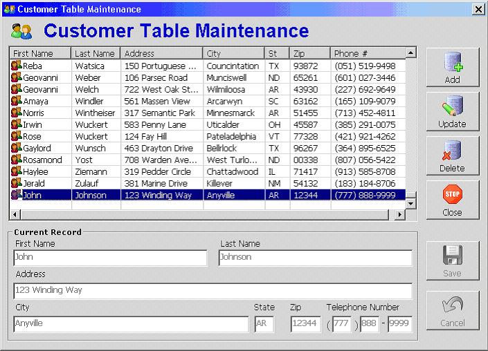



## Intro to ADO \- Part 2 \(with ListView\)

### Description

This sample project demonstrates uses of ADO not covered in the preceding topic. The sample project presented here is a simple "one-table" database application. It works with a table of customer data (name, address, phone, etc.) and allows the user to view, add, update, and delete customer records. This sample project uses a DSN-less connection (compared to the Intro to ADO Part 1 tutorial which used DSN). Also, this sample project uses the ListView control to display the records that the application will be working with. A tutorial on the use of the ListView control is covered at the end of the article.
 
### More Info
 

             |
---                |---
**Submitted On**   |2006-10-02 12:17:18
**By**             |[TheVBPro](https://github.com/Planet-Source-Code/PSCIndex/blob/master/ByAuthor/thevbpro.md)
**Level**          |Intermediate
**User Rating**    |4.7 (14 globes from 3 users)
**Compatibility**  |VB 6\.0
**Category**       |[Databases/ Data Access/ DAO/ ADO](https://github.com/Planet-Source-Code/PSCIndex/blob/master/ByCategory/databases-data-access-dao-ado__1-6.md)
**World**          |[Visual Basic](https://github.com/Planet-Source-Code/PSCIndex/blob/master/ByWorld/visual-basic.md)
**Archive File**   |[Intro\_to\_A2022811022006\.zip](https://github.com/Planet-Source-Code/thevbpro-intro-to-ado-part-2-with-listview__1-66688/archive/master.zip)

